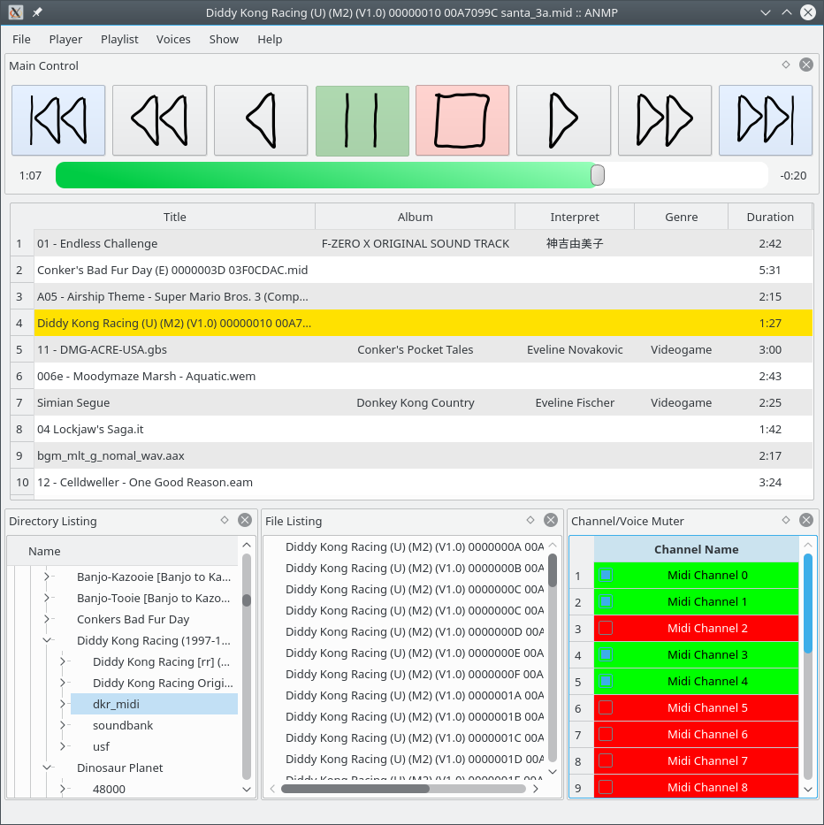

# ANMP
**A**nother **N**ameless **M**usic **P**layer



## Features

ANMP aims to be a versatile but lightweight audio player, just as the other hundred thousands out there.

What ANMP does NOT:
* crawl through your music library, building a huge useless database for all artists, albums, genres, titles, etc., just because the user wants to have a nice overview over what is on his HDD (SSD); the filesystem is our database!
* mess around with any audio files, i.e. no changing of ID3 tags, no writing of ReplayGain or whatever; additional info will always be written to separate files and ONLY then, when the user explicitly says so (e.g. by executing anmp-normalize)
* provide a multilingual GUI; everything is done in English!

#### Main Features

* gapless playback
* cue sheets
* arbitrary (forward) looping of songs
* easy attempt to implement new formats

ANMP handles audio differently than others: Instead of retrieving only small buffers that hold the raw pcm data, ANMP fetches the pcm of the whole file and puts that into memory (well this is at least the case for streamed audio files). Todays computers have enough memory to hold raw pcm of even longer audio files. Uncompressing big audio files can take a long time. Thus filling the pcm buffer is usually done asynchronously. When the next song shall be played, the pcm buffer of the former song is released.

However, ANMP also supports rendering pcm to a small buffer. The method will be used if there is not enough memory available to hold a whole song in memory. This is esp. true, if the user requests infinite playback and the underlying song supports that but doesnt specify any loop points (as it applies to e.g. the Ultra64 Sound Format (USF)). In this case pcm gets rendered to a small buffer. Whenever this method is used, there will be no seeking within the song possible though.

Cue sheets will just add the same song file multiple times to a playlist, but with different file-offsets.

Implementing new formats shall be done by implementing the abstract base class **Song**. By that a wrapper for any library that actually supports this format is written.

The core of ANMP (i.e. everything not in [src/GUI](src/GUI)) is strictly keept free of any QT5 dependencies. Makes reuseage a lot easier.

## Get ANMP
see [HERE](https://software.opensuse.org/download.html?project=home%3Aderselbst%3Aanmp&package=anmp) for precompiled packages


## Build Dependencies

* cmake >= 2.8
* gcc >= 4.8.1, or any other C++11 compliant compiler
* Qt5Widgets (highly recommended for GUI support, since there currently is no CLI)

#### At least one of the following codec libraries
(depending on which audio formats ANMP shall be able to play)
* [libsndfile](http://www.mega-nerd.com/libsndfile/) (strongly recommended to play most common audio formats)
* [mad](https://sourceforge.net/projects/mad/files/libmad/) >= 0.15.1b (to play mp3 files)
* [ffmpeg](https://ffmpeg.org) >= 2.8.6 (specifically libavcodec, libavformat, libavutil, libswresample)
* [lazyusf2](https://gitlab.kode54.net/kode54/lazyusf2) (to play Ultra64 Sound Format (usf))
* [libgme](https://bitbucket.org/mpyne/game-music-emu) (Famicom (nsf), SuperFamicon (spc), GameBoy (gbs), etc.)
* [vgmstream](https://gitlab.kode54.net/kode54/vgmstream) (various audio formats from sixth generation video game consoles and following)

#### For audio playback: at least one of the following audio I/O libraries
(if none of them, only WAVE files can be written)
* ALSA (audio playback on Linux only)
* [Jack](http://jackaudio.org/) (low latency audio playback; also requires [libsamplearate](http://www.mega-nerd.com/SRC/))
* [PortAudio](http://www.portaudio.com/) (for crossplatform audio playback support)

### Optional
* [libcue](https://github.com/lipnitsk/libcue) (for cuesheet support)
* [libebur128](https://github.com/jiixyj/libebur128) (for generating loudness normalization files (*.ebur128) using anmp-normalize)
* Qt5OpenGL (for nice blinky audio visualizers)

## Building from Source
```shell
mkdir build && cd build
cmake ..
make
```

